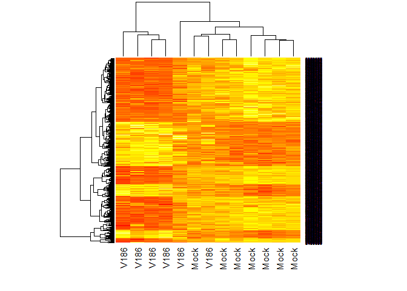
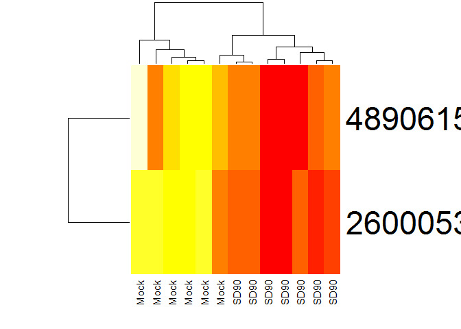
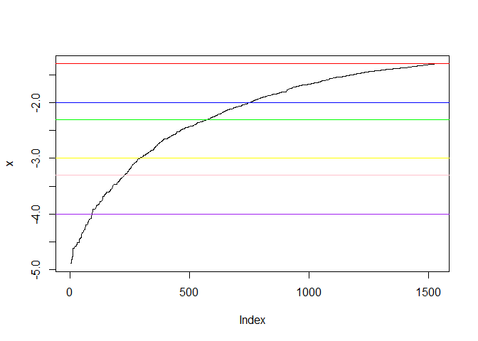

"Vaginal explant herpes infection experiment"

    ## Inputting the data ...
    ## Perform Quality Control assessment of the LumiBatch object ...

EXPERIMENT NOTES 6 samples failed when the microarray was run 6,33,34,35,45,63 and two failed QC (36,64). The failed were left out of the finalReport filethat we got from shared resources and we will leave all 8 out of the analysis too.

ALSO

The first 5 samples in the micrarray data are T cells that were exposed to Tenofovir. These will be analyzed separately and can be separated from the vaginal explant data.

SOME PLOTS OF NON NORMALIZED DATA: density plot, cdf plot    

    ## Perform vst transformation ...
    ## 2015-12-15 10:04:23 , processing array  1 
    ## 2015-12-15 10:04:23 , processing array  2 
    ## 2015-12-15 10:04:23 , processing array  3 
    ## 2015-12-15 10:04:23 , processing array  4 
    ## 2015-12-15 10:04:23 , processing array  5 
    ## 2015-12-15 10:04:23 , processing array  6 
    ## 2015-12-15 10:04:23 , processing array  7 
    ## 2015-12-15 10:04:23 , processing array  8 
    ## 2015-12-15 10:04:23 , processing array  9 
    ## 2015-12-15 10:04:23 , processing array  10 
    ## 2015-12-15 10:04:23 , processing array  11 
    ## 2015-12-15 10:04:23 , processing array  12 
    ## 2015-12-15 10:04:23 , processing array  13 
    ## 2015-12-15 10:04:23 , processing array  14 
    ## 2015-12-15 10:04:23 , processing array  15 
    ## 2015-12-15 10:04:24 , processing array  16 
    ## 2015-12-15 10:04:24 , processing array  17 
    ## 2015-12-15 10:04:24 , processing array  18 
    ## 2015-12-15 10:04:24 , processing array  19 
    ## 2015-12-15 10:04:24 , processing array  20 
    ## 2015-12-15 10:04:24 , processing array  21 
    ## 2015-12-15 10:04:24 , processing array  22 
    ## 2015-12-15 10:04:24 , processing array  23 
    ## 2015-12-15 10:04:24 , processing array  24 
    ## 2015-12-15 10:04:24 , processing array  25 
    ## 2015-12-15 10:04:24 , processing array  26 
    ## 2015-12-15 10:04:25 , processing array  27 
    ## 2015-12-15 10:04:25 , processing array  28 
    ## 2015-12-15 10:04:25 , processing array  29 
    ## 2015-12-15 10:04:25 , processing array  30 
    ## 2015-12-15 10:04:25 , processing array  31 
    ## 2015-12-15 10:04:25 , processing array  32 
    ## 2015-12-15 10:04:25 , processing array  33 
    ## 2015-12-15 10:04:25 , processing array  34 
    ## 2015-12-15 10:04:25 , processing array  35 
    ## 2015-12-15 10:04:25 , processing array  36 
    ## 2015-12-15 10:04:25 , processing array  37 
    ## 2015-12-15 10:04:25 , processing array  38 
    ## 2015-12-15 10:04:25 , processing array  39 
    ## 2015-12-15 10:04:25 , processing array  40 
    ## 2015-12-15 10:04:25 , processing array  41 
    ## 2015-12-15 10:04:25 , processing array  42 
    ## 2015-12-15 10:04:26 , processing array  43 
    ## 2015-12-15 10:04:26 , processing array  44 
    ## 2015-12-15 10:04:26 , processing array  45 
    ## 2015-12-15 10:04:26 , processing array  46 
    ## 2015-12-15 10:04:26 , processing array  47 
    ## 2015-12-15 10:04:26 , processing array  48 
    ## 2015-12-15 10:04:26 , processing array  49 
    ## 2015-12-15 10:04:26 , processing array  50 
    ## 2015-12-15 10:04:26 , processing array  51 
    ## 2015-12-15 10:04:26 , processing array  52 
    ## 2015-12-15 10:04:26 , processing array  53 
    ## 2015-12-15 10:04:26 , processing array  54 
    ## 2015-12-15 10:04:26 , processing array  55 
    ## 2015-12-15 10:04:26 , processing array  56

    ## Perform rsn normalization ...
    ## 2015-12-15 10:04:28 , processing array  1 
    ## 2015-12-15 10:04:28 , processing array  2 
    ## 2015-12-15 10:04:28 , processing array  3 
    ## 2015-12-15 10:04:28 , processing array  4 
    ## 2015-12-15 10:04:29 , processing array  5 
    ## 2015-12-15 10:04:29 , processing array  6 
    ## 2015-12-15 10:04:29 , processing array  7 
    ## 2015-12-15 10:04:29 , processing array  8 
    ## 2015-12-15 10:04:29 , processing array  9 
    ## 2015-12-15 10:04:29 , processing array  10 
    ## 2015-12-15 10:04:29 , processing array  11 
    ## 2015-12-15 10:04:29 , processing array  12 
    ## 2015-12-15 10:04:29 , processing array  13 
    ## 2015-12-15 10:04:29 , processing array  14 
    ## 2015-12-15 10:04:29 , processing array  15 
    ## 2015-12-15 10:04:30 , processing array  16 
    ## 2015-12-15 10:04:30 , processing array  17 
    ## 2015-12-15 10:04:30 , processing array  18 
    ## 2015-12-15 10:04:30 , processing array  19 
    ## 2015-12-15 10:04:30 , processing array  20 
    ## 2015-12-15 10:04:30 , processing array  21 
    ## 2015-12-15 10:04:30 , processing array  22 
    ## 2015-12-15 10:04:30 , processing array  23 
    ## 2015-12-15 10:04:30 , processing array  24 
    ## 2015-12-15 10:04:30 , processing array  25 
    ## 2015-12-15 10:04:31 , processing array  26 
    ## 2015-12-15 10:04:31 , processing array  27 
    ## 2015-12-15 10:04:31 , processing array  28 
    ## 2015-12-15 10:04:31 , processing array  29 
    ## 2015-12-15 10:04:31 , processing array  30 
    ## 2015-12-15 10:04:31 , processing array  31 
    ## 2015-12-15 10:04:31 , processing array  32 
    ## 2015-12-15 10:04:31 , processing array  33 
    ## 2015-12-15 10:04:31 , processing array  34 
    ## 2015-12-15 10:04:31 , processing array  35 
    ## 2015-12-15 10:04:31 , processing array  36 
    ## 2015-12-15 10:04:32 , processing array  37 
    ## 2015-12-15 10:04:32 , processing array  38 
    ## 2015-12-15 10:04:32 , processing array  39 
    ## 2015-12-15 10:04:32 , processing array  40 
    ## 2015-12-15 10:04:32 , processing array  41 
    ## 2015-12-15 10:04:32 , processing array  42 
    ## 2015-12-15 10:04:32 , processing array  43 
    ## 2015-12-15 10:04:32 , processing array  44 
    ## 2015-12-15 10:04:32 , processing array  45 
    ## 2015-12-15 10:04:32 , processing array  46 
    ## 2015-12-15 10:04:33 , processing array  47 
    ## 2015-12-15 10:04:33 , processing array  48 
    ## 2015-12-15 10:04:33 , processing array  49 
    ## 2015-12-15 10:04:33 , processing array  50 
    ## 2015-12-15 10:04:33 , processing array  51 
    ## 2015-12-15 10:04:33 , processing array  52 
    ## 2015-12-15 10:04:33 , processing array  53 
    ## 2015-12-15 10:04:33 , processing array  54 
    ## 2015-12-15 10:04:33 , processing array  55 
    ## 2015-12-15 10:04:33 , processing array  56

    ## Perform Quality Control assessment of the LumiBatch object ...

PLOTS OF NORMALIZED DATA

   FILTERING PROBES BASED ON DETECTION Limma suggests to keep probes that are expressed above bg on at least n arrays where n is smallest number of replicates assigned to any of the treatment combinations.

Our treatment combinations are TissueID/Treatment/Time We have 7 Tissue IDs x 3 Treatments x 3 time points=63 so the smallest number of replicates possible for any of those 63 arrays is 7

how many probes did we have before and after filtering?

    ##          detection exprs se.exprs
    ## Features     47323 47323    47323
    ## Samples         56    56       56

    ##          detection exprs se.exprs
    ## Features     27126 27126    27126
    ## Samples         56    56       56

how many removed?

    ##          detection exprs se.exprs
    ## Features     20197 20197    20197
    ## Samples          0     0        0

How many probes are up and down regulated for each contrast?

    ## Source: local data frame [6 x 3]
    ## 
    ##           variable  down    up
    ##             (fctr) (int) (int)
    ## 1   V186.3vsMock.3    12    10
    ## 2   V186.8vsMock.8     8     1
    ## 3 V186.24vsMock.24   993   534
    ## 4   SD90.3vsMock.3     2     0
    ## 5   SD90.8vsMock.8     0     0
    ## 6 SD90.24vsMock.24     0     0

Heatmaps of the first 4 contrasts: V186 vs mock at 3hr, 8hr, and 24 hrs, SD90 vs Mock at 3 hrs

    

    ## [[1]]
    ## NULL
    ## 
    ## [[2]]
    ## NULL
    ## 
    ## [[3]]
    ## NULL
    ## 
    ## [[4]]
    ## NULL
    ## 
    ## [[5]]
    ## NULL
    ## 
    ## [[6]]
    ## NULL

Looks like there would still be a lot (hundreds)of DE probes for the v186 24hr comparison if reduced the adj p val cutoff to 0.01, but that would reduce the \# of DE probes in the v186.3 to ~2 and v186.8 to ~3. The SD90.3 would be 2 and SD90.8 and .24 were already zero with p\<=0.05

    ##         ProbeID TargetID ILMN_GENE ENTREZ_GENE_ID       GI   ACCESSION
    ## 1430239 1430239      UBC       UBC             NA 20149305 NM_021009.1
    ##         SYMBOL     PROBE_ID PROBE_START
    ## 1430239    UBC ILMN_2038773        1059
    ##                                             PROBE_SEQUENCE CHROMOSOME
    ## 1430239 CGTGAAGACCCTGACTGGTAAGACCATCACTCTCGAAGTGGAGCCGAGTG           
    ##         PROBE_CHR_ORIENTATION PROBE_COORDINATES
    ## 1430239
