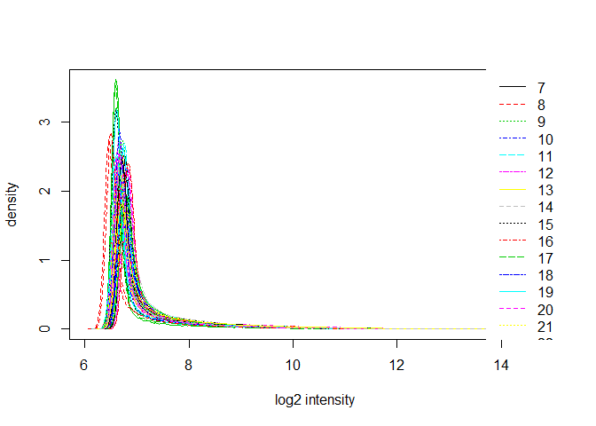
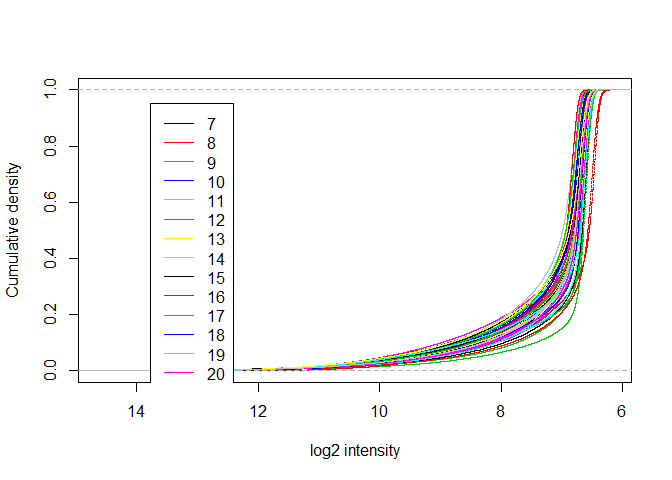
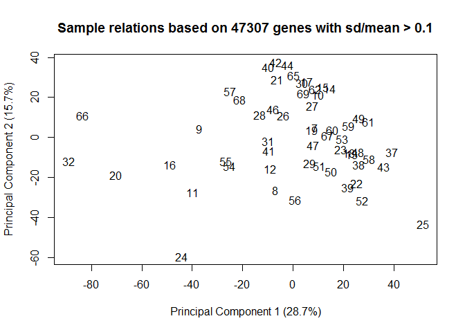
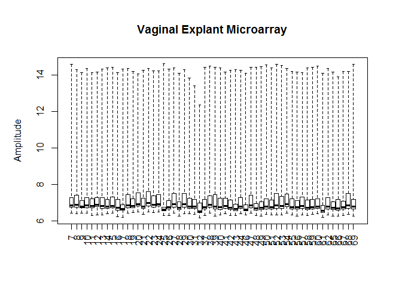

"Vaginal explant herpes infection experiment"

EXPERIMENT NOTES

6 samples failed when the microarray was run (6, 33, 34, 35, 45, 63) and two failed QC (36,64).

FAILED SAMPLES 6 One of the T-cell samples, not included in the explant study

33 ID326 3hr MOCK

34 ID 326 8hr SD90

35 ID 326 24hr V186

36 ID 317 8hr MOCK

45 ID 318 24hr SD90

63 ID 327 8hr SD90

64 ID 319 8hr MOCK

Samples that failed the finalReport file were not included in the report we got from shared resources and I removed the ones that failed QC.

ALSO

The first 6 samples in the micrarray data are T cells that were exposed to Tenofovir. These will be analyzed separately so I removed them from the data set here.

SOME PLOTS OF NON NORMALIZED DATA: density plot, cdf plot, sample relations

PLOTS OF NORMALIZED DATA

FILTERING PROBES Limma suggests to keep probes that are expressed above background on at least n arrays where n is smallest number of replicates assigned to any of the treatment combinations.

Our treatment combinations are TissueID/Treatment/Time. We have 7 replicates (donors) for each of the treatment combinations so I kept probes with detection levels above background in at least 7 samples.

Number of probes in data set before filtering:

    ## [1] 47323

Number of probes in data set after filtering:

    ## [1] 27126

Number of probes removed by filtering:

    ## [1] 20197

The design matrix includes a combined treatment + timepoint parameter (Treat) and a donor parameter (TissueID).

Then we choose the comparisons we want to analyze. I compared each treatment + timepoint condition with the corresponding mock infection in the same donor. This gives 6 contrasts to analyze:

V186.3vsMock.3

V186.8vsMock.8

V186.24vsMock.24

SD90.3vsMock.3

SD90.8vsMock.8

SD90.24vsMock.24

After fitting the contrasts to the model using our design matrix, we can see how many probes are up and down-regulated for each contrast, based on a p-value cut-off of 0.05 and a log-fold-change cut-off of 0.5.

<table style="width:39%;">
<colgroup>
<col width="23%" />
<col width="9%" />
<col width="5%" />
</colgroup>
<thead>
<tr class="header">
<th align="center">variable</th>
<th align="center">down</th>
<th align="center">up</th>
</tr>
</thead>
<tbody>
<tr class="odd">
<td align="center">V186.3vsMock.3</td>
<td align="center">12</td>
<td align="center">10</td>
</tr>
<tr class="even">
<td align="center">V186.8vsMock.8</td>
<td align="center">8</td>
<td align="center">1</td>
</tr>
<tr class="odd">
<td align="center">V186.24vsMock.24</td>
<td align="center">993</td>
<td align="center">534</td>
</tr>
<tr class="even">
<td align="center">SD90.3vsMock.3</td>
<td align="center">2</td>
<td align="center">0</td>
</tr>
<tr class="odd">
<td align="center">SD90.8vsMock.8</td>
<td align="center">0</td>
<td align="center">0</td>
</tr>
<tr class="even">
<td align="center">SD90.24vsMock.24</td>
<td align="center">0</td>
<td align="center">0</td>
</tr>
</tbody>
</table>

V186 vs mock at 3hr

V186 vs mock at 8hr

V186 vs mock at 24hr

SD90vsMock at 3hr

Heat map of V186 AND SD90 at 24hr for probes that were sig for V186.24

Next I used InnateDB to do GO and Pathway overrepresentation analyses for the V186.24 vs Mock condition for up and down regulated probes.

    ## R version 3.3.0 (2016-05-03)
    ## Platform: x86_64-w64-mingw32/x64 (64-bit)
    ## Running under: Windows 7 x64 (build 7601) Service Pack 1
    ## 
    ## locale:
    ## [1] LC_COLLATE=English_United States.1252 
    ## [2] LC_CTYPE=English_United States.1252   
    ## [3] LC_MONETARY=English_United States.1252
    ## [4] LC_NUMERIC=C                          
    ## [5] LC_TIME=English_United States.1252    
    ## 
    ## attached base packages:
    ## [1] parallel  stats     graphics  grDevices utils     datasets  methods  
    ## [8] base     
    ## 
    ## other attached packages:
    ##  [1] tidyr_0.6.0         reshape2_1.4.1      ggplot2_2.1.0      
    ##  [4] stringr_1.1.0       pander_0.6.0        limma_3.22.7       
    ##  [7] lumi_2.18.0         Biobase_2.26.0      BiocGenerics_0.12.1
    ## [10] dplyr_0.5.0         plyr_1.8.4         
    ## 
    ## loaded via a namespace (and not attached):
    ##  [1] nor1mix_1.2-1           splines_3.3.0          
    ##  [3] foreach_1.4.3           bumphunter_1.6.0       
    ##  [5] assertthat_0.1          affy_1.44.0            
    ##  [7] stats4_3.3.0            doRNG_1.6              
    ##  [9] Rsamtools_1.18.3        methylumi_2.12.0       
    ## [11] yaml_2.1.13             minfi_1.12.0           
    ## [13] backports_1.0.3         RSQLite_1.0.0          
    ## [15] lattice_0.20-33         quadprog_1.5-5         
    ## [17] digest_0.6.10           checkmate_1.8.1        
    ## [19] GenomicRanges_1.18.4    RColorBrewer_1.1-2     
    ## [21] XVector_0.6.0           colorspace_1.2-6       
    ## [23] htmltools_0.3.5         preprocessCore_1.28.0  
    ## [25] Matrix_1.2-6            siggenes_1.40.0        
    ## [27] XML_3.98-1.4            biomaRt_2.22.0         
    ## [29] genefilter_1.48.1       zlibbioc_1.12.0        
    ## [31] xtable_1.8-2            scales_0.4.0           
    ## [33] brew_1.0-6              affyio_1.34.0          
    ## [35] BiocParallel_1.0.3      tibble_1.1             
    ## [37] openssl_0.9.4           annotate_1.44.0        
    ## [39] nleqslv_3.0.3           beanplot_1.2           
    ## [41] mgcv_1.8-14             pkgmaker_0.22          
    ## [43] IRanges_2.0.1           GenomicFeatures_1.18.7 
    ## [45] lazyeval_0.2.0          survival_2.39-5        
    ## [47] magrittr_1.5            mclust_5.2             
    ## [49] evaluate_0.9            fail_1.3               
    ## [51] nlme_3.1-128            MASS_7.3-45            
    ## [53] BiocInstaller_1.16.5    tools_3.3.0            
    ## [55] registry_0.3            BBmisc_1.10            
    ## [57] formatR_1.4             matrixStats_0.50.2     
    ## [59] sendmailR_1.2-1         S4Vectors_0.4.0        
    ## [61] munsell_0.4.3           locfit_1.5-9.1         
    ## [63] rngtools_1.2.4          AnnotationDbi_1.28.2   
    ## [65] Biostrings_2.34.1       base64_2.0             
    ## [67] GenomeInfoDb_1.2.5      grid_3.3.0             
    ## [69] RCurl_1.95-4.8          iterators_1.0.8        
    ## [71] base64enc_0.1-3         bitops_1.0-6           
    ## [73] rmarkdown_1.0           gtable_0.2.0           
    ## [75] codetools_0.2-14        multtest_2.22.0        
    ## [77] DBI_0.5                 reshape_0.8.5          
    ## [79] R6_2.1.3                illuminaio_0.8.0       
    ## [81] GenomicAlignments_1.2.2 knitr_1.14             
    ## [83] rtracklayer_1.26.3      KernSmooth_2.23-15     
    ## [85] stringi_1.1.1           BatchJobs_1.6          
    ## [87] Rcpp_0.12.6
