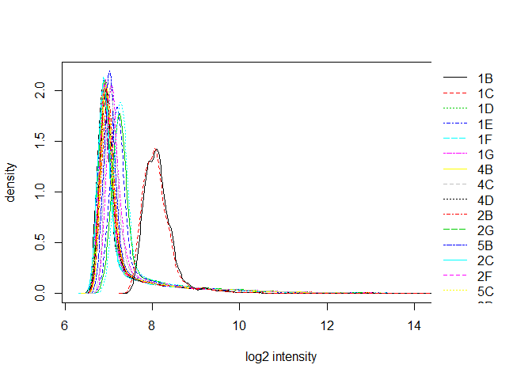
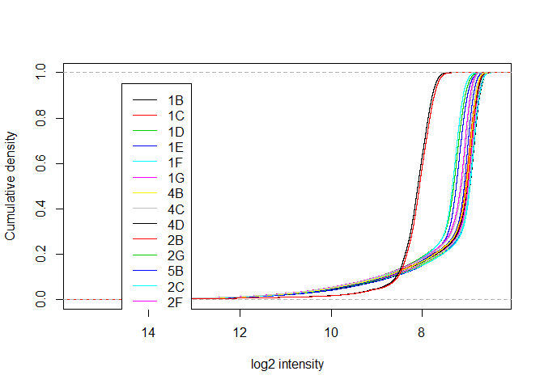
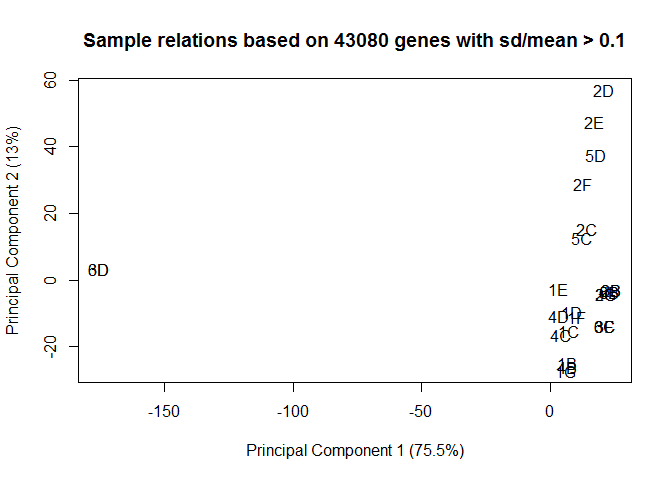
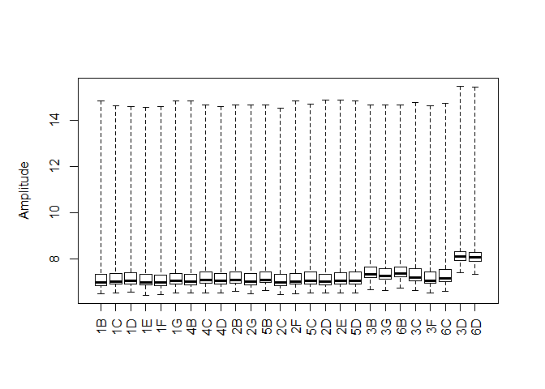
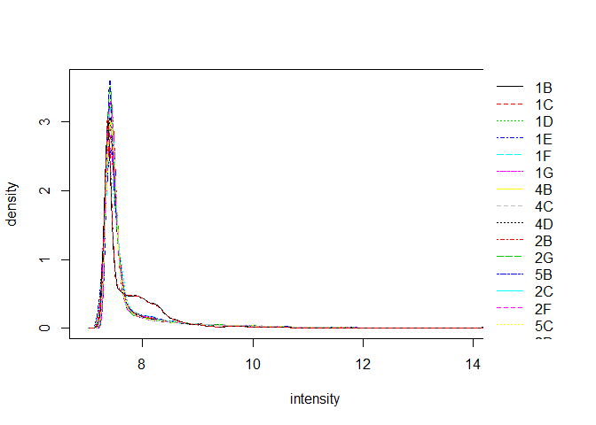
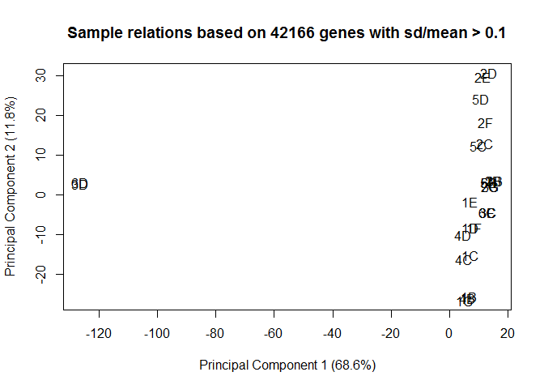
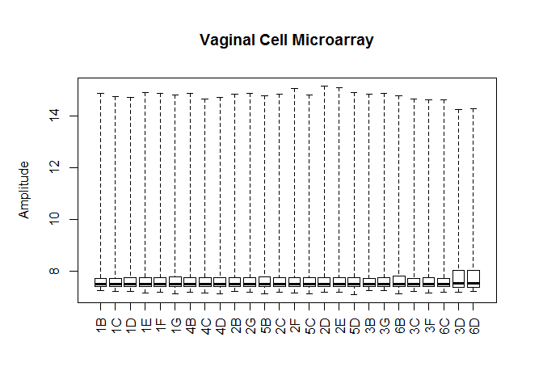
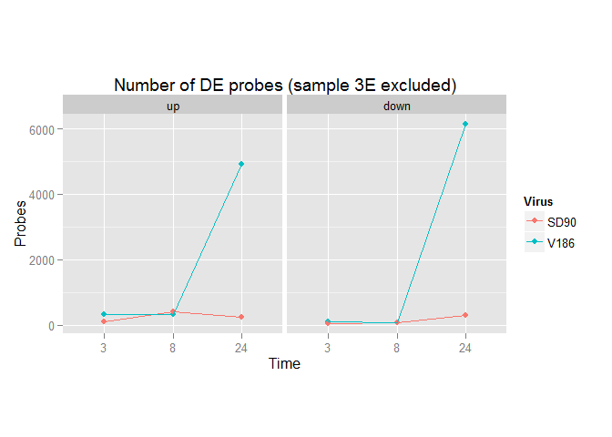

"Vaginal cell herpes infection experiment"

    ## Inputting the data ...
    ## Perform Quality Control assessment of the LumiBatch object ...

SOME PLOTS OF NON NORMALIZED DATA: LMF left sample 3E out of the analysis because it was determined that there was some kind of pipetting error. FH told me that when he looked at the analyzed data, 3E looked very similar to the SD90 data but very different from the other 2 V186.24 replicates (samples 6D and 3D) so he didn't feel comfortable leaving it in the analysis. I am also leaving it out here.

Density plot, cdf plot, sample relations, boxplot. Looks like 3D and 6D are outliers, both are V186 24hrs.

   

    ## Perform vst transformation ...
    ## 2015-12-23 12:20:15 , processing array  1 
    ## 2015-12-23 12:20:15 , processing array  2 
    ## 2015-12-23 12:20:16 , processing array  3 
    ## 2015-12-23 12:20:16 , processing array  4 
    ## 2015-12-23 12:20:16 , processing array  5 
    ## 2015-12-23 12:20:16 , processing array  6 
    ## 2015-12-23 12:20:16 , processing array  7 
    ## 2015-12-23 12:20:16 , processing array  8 
    ## 2015-12-23 12:20:16 , processing array  9 
    ## 2015-12-23 12:20:16 , processing array  10 
    ## 2015-12-23 12:20:16 , processing array  11 
    ## 2015-12-23 12:20:16 , processing array  12 
    ## 2015-12-23 12:20:16 , processing array  13 
    ## 2015-12-23 12:20:17 , processing array  14 
    ## 2015-12-23 12:20:17 , processing array  15 
    ## 2015-12-23 12:20:17 , processing array  16 
    ## 2015-12-23 12:20:17 , processing array  17 
    ## 2015-12-23 12:20:17 , processing array  18 
    ## 2015-12-23 12:20:17 , processing array  19 
    ## 2015-12-23 12:20:17 , processing array  20 
    ## 2015-12-23 12:20:17 , processing array  21 
    ## 2015-12-23 12:20:17 , processing array  22 
    ## 2015-12-23 12:20:17 , processing array  23 
    ## 2015-12-23 12:20:17 , processing array  24 
    ## 2015-12-23 12:20:17 , processing array  25 
    ## 2015-12-23 12:20:17 , processing array  26

    ## Perform rsn normalization ...
    ## 2015-12-23 12:20:18 , processing array  1 
    ## 2015-12-23 12:20:18 , processing array  2 
    ## 2015-12-23 12:20:19 , processing array  3 
    ## 2015-12-23 12:20:19 , processing array  4 
    ## 2015-12-23 12:20:19 , processing array  5 
    ## 2015-12-23 12:20:19 , processing array  6 
    ## 2015-12-23 12:20:19 , processing array  7 
    ## 2015-12-23 12:20:19 , processing array  8 
    ## 2015-12-23 12:20:19 , processing array  9 
    ## 2015-12-23 12:20:19 , processing array  10 
    ## 2015-12-23 12:20:19 , processing array  11 
    ## 2015-12-23 12:20:19 , processing array  12 
    ## 2015-12-23 12:20:19 , processing array  13 
    ## 2015-12-23 12:20:20 , processing array  14 
    ## 2015-12-23 12:20:20 , processing array  15 
    ## 2015-12-23 12:20:20 , processing array  16 
    ## 2015-12-23 12:20:20 , processing array  17 
    ## 2015-12-23 12:20:20 , processing array  18 
    ## 2015-12-23 12:20:20 , processing array  19 
    ## 2015-12-23 12:20:20 , processing array  20 
    ## 2015-12-23 12:20:21 , processing array  21 
    ## 2015-12-23 12:20:21 , processing array  22 
    ## 2015-12-23 12:20:21 , processing array  23 
    ## 2015-12-23 12:20:21 , processing array  24 
    ## 2015-12-23 12:20:21 , processing array  25 
    ## 2015-12-23 12:20:21 , processing array  26

    ## Perform Quality Control assessment of the LumiBatch object ...

PLOTS OF NORMALIZED DATA: all data, then just 6D and 3D

   FILTERING PROBES BASED ON DETECTION Limma suggests to keep probes that are expressed above bg on at least n arrays where n is smallest number of replicates assigned to any of the treatment combinations.

Our treatment combinations are TissueID/Treatment/Time We have 3 Tissue IDs x 3 Treatments x 3 time points = 27 so the smallest number of replicates possible for any of those 3 arrays is 3

how many probes did we have before and after filtering?

    ##          detection exprs se.exprs
    ## Features     47323 47323    47323
    ## Samples         26    26       26

    ##          detection exprs se.exprs
    ## Features     22894 22894    22894
    ## Samples         26    26       26

How many removed?

    ##          detection exprs se.exprs
    ## Features     24429 24429    24429
    ## Samples          0     0        0

Here's the design matrix for the analysis

    ##    TreatMock.24 TreatMock.3 TreatMock.8 TreatSD90.24 TreatSD90.3
    ## 1             0           1           0            0           0
    ## 2             0           0           0            0           1
    ## 3             0           0           0            0           0
    ## 4             0           0           0            0           0
    ## 5             0           0           0            0           1
    ## 6             0           1           0            0           0
    ## 7             0           1           0            0           0
    ## 8             0           0           0            0           1
    ## 9             0           0           0            0           0
    ## 10            0           0           1            0           0
    ## 11            0           0           1            0           0
    ## 12            0           0           1            0           0
    ## 13            0           0           0            0           0
    ## 14            0           0           0            0           0
    ## 15            0           0           0            0           0
    ## 16            0           0           0            0           0
    ## 17            0           0           0            0           0
    ## 18            0           0           0            0           0
    ## 19            1           0           0            0           0
    ## 20            1           0           0            0           0
    ## 21            1           0           0            0           0
    ## 22            0           0           0            1           0
    ## 23            0           0           0            1           0
    ## 24            0           0           0            1           0
    ## 25            0           0           0            0           0
    ## 26            0           0           0            0           0
    ##    TreatSD90.8 TreatV186.24 TreatV186.3 TreatV186.8 TissueID3 TissueID4
    ## 1            0            0           0           0         0         0
    ## 2            0            0           0           0         0         0
    ## 3            0            0           1           0         0         0
    ## 4            0            0           1           0         0         1
    ## 5            0            0           0           0         0         1
    ## 6            0            0           0           0         0         1
    ## 7            0            0           0           0         1         0
    ## 8            0            0           0           0         1         0
    ## 9            0            0           1           0         1         0
    ## 10           0            0           0           0         0         0
    ## 11           0            0           0           0         0         1
    ## 12           0            0           0           0         1         0
    ## 13           1            0           0           0         0         0
    ## 14           1            0           0           0         0         1
    ## 15           1            0           0           0         1         0
    ## 16           0            0           0           1         0         0
    ## 17           0            0           0           1         0         1
    ## 18           0            0           0           1         1         0
    ## 19           0            0           0           0         0         0
    ## 20           0            0           0           0         0         1
    ## 21           0            0           0           0         1         0
    ## 22           0            0           0           0         0         0
    ## 23           0            0           0           0         0         1
    ## 24           0            0           0           0         1         0
    ## 25           0            1           0           0         0         0
    ## 26           0            1           0           0         1         0
    ## attr(,"assign")
    ##  [1] 1 1 1 1 1 1 1 1 1 2 2
    ## attr(,"contrasts")
    ## attr(,"contrasts")$Treat
    ## [1] "contr.treatment"
    ## 
    ## attr(,"contrasts")$TissueID
    ## [1] "contr.treatment"

Here's the contrasts matrix

    ##               Contrasts
    ## Levels         V186.3vsMock.3 V186.8vsMock.8 V186.24vsMock.24
    ##   TreatMock.24              0              0               -1
    ##   TreatMock.3              -1              0                0
    ##   TreatMock.8               0             -1                0
    ##   TreatSD90.24              0              0                0
    ##   TreatSD90.3               0              0                0
    ##   TreatSD90.8               0              0                0
    ##   TreatV186.24              0              0                1
    ##   TreatV186.3               1              1                0
    ##   TreatV186.8               0              0                0
    ##   TissueID3                 0              0                0
    ##   TissueID4                 0              0                0
    ##               Contrasts
    ## Levels         SD90.3vsMock.3 SD90.8vsMock.8 SD90.24vsMock.24
    ##   TreatMock.24              0              0               -1
    ##   TreatMock.3              -1              0                0
    ##   TreatMock.8               0             -1                0
    ##   TreatSD90.24              0              0                1
    ##   TreatSD90.3               1              0                0
    ##   TreatSD90.8               0              1                0
    ##   TreatV186.24              0              0                0
    ##   TreatV186.3               0              0                0
    ##   TreatV186.8               0              0                0
    ##   TissueID3                 0              0                0
    ##   TissueID4                 0              0                0

How many probes are up and down regulated for each contrast?

    ## Source: local data frame [6 x 3]
    ## 
    ##           variable  down    up
    ##             (fctr) (int) (int)
    ## 1   V186.3vsMock.3    97   321
    ## 2   V186.8vsMock.8    79   335
    ## 3 V186.24vsMock.24  6150  4926
    ## 4   SD90.3vsMock.3    47   101
    ## 5   SD90.8vsMock.8    74   402
    ## 6 SD90.24vsMock.24   287   254

