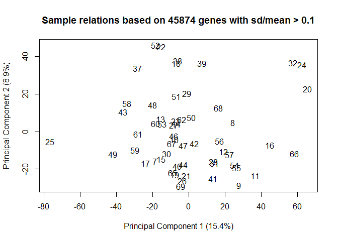
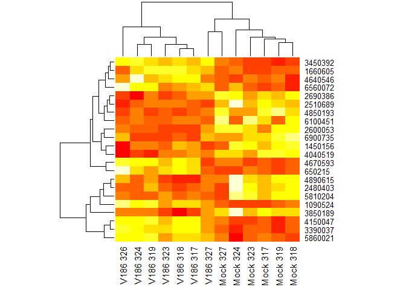

"Vaginal explant herpes infection experiment"

EXPERIMENT NOTES

6 samples failed when the microarray was run( 6,33,34,35,45,63) and two failed QC (36,64).

6= One of the T-cell samples, not included in explant study 33=ID326 T1 M 34=ID 326 T2 V1 35=ID 326 T3 V2 36 ID 317 T2 M 45 ID 318 T3 V1 63 ID 327 T2 V1 64 ID 319 T2 M

Samples that failed the finalReport file were not included in the report we got from shared resources and I removed the ones that failed QC.

ALSO

The first 5 samples in the micrarray data are T cells that were exposed to Tenofovir. These will be analyzed separately so I removed them from the data set here.

SOME PLOTS OF NON NORMALIZED DATA: density plot, cdf plot, sample relations

   

PLOTS OF NORMALIZED DATA

  

FILTERING PROBES Limma suggests to keep probes that are expressed above background on at least n arrays where n is smallest number of replicates assigned to any of the treatment combinations.

Our treatment combinations are TissueID/Treatment/Time. We have 7 replicates (donors) for each of the treatment combinations so I kept probes with detection levels above background in at least 7 samples.

Number of probes in data set before filtering:

    ## [1] 47323

Number of probes in data set after filtering:

    ## [1] 27126

Number of probes removed by filtering:

    ## [1] 20197

The design matrix includes a combined treatment + timepoint parameter('r"Treat"') and a donor parameter ('r "TissueID"').

'r design \<-(~0+Treat+TissueID)'

Then we choose the comparisons we want to analyze. I will compare treatment + timepoint condition with the corresponding mock infection in the same donor. This gives 6 contrasts to analyze:

V186.3vsMock.3 V186.8vsMock.8 V186.24vsMock.24

SD90.3vsMock.3 SD90.8vsMock.8 SD90.24vsMock.24

After fitting the contrasts to the model using our design matrix, we can see how many probes are up and down-regulated for each contras, based on a p-value cut-off of 0.05 and a log-fold-change cut-off of 0.5.

<table>
<colgroup>
<col width="23%" />
<col width="9%" />
<col width="5%" />
</colgroup>
<thead>
<tr class="header">
<th align="center">variable</th>
<th align="center">down</th>
<th align="center">up</th>
</tr>
</thead>
<tbody>
<tr class="odd">
<td align="center">V186.3vsMock.3</td>
<td align="center">12</td>
<td align="center">10</td>
</tr>
<tr class="even">
<td align="center">V186.8vsMock.8</td>
<td align="center">8</td>
<td align="center">1</td>
</tr>
<tr class="odd">
<td align="center">V186.24vsMock.24</td>
<td align="center">993</td>
<td align="center">534</td>
</tr>
<tr class="even">
<td align="center">SD90.3vsMock.3</td>
<td align="center">2</td>
<td align="center">0</td>
</tr>
<tr class="odd">
<td align="center">SD90.8vsMock.8</td>
<td align="center">0</td>
<td align="center">0</td>
</tr>
<tr class="even">
<td align="center">SD90.24vsMock.24</td>
<td align="center">0</td>
<td align="center">0</td>
</tr>
</tbody>
</table>

Heatmaps of the first 4 contrasts: V186 vs mock at 3hr, 8hr, and 24 hrs, SD90 vs Mock at 3 hrs. Last plot is of the same probes found to be DE in V186.24vsMock but looking at their expression in the SD90.24vsMock condition, just to see if there is a similar pattern.

    

SessionInfo()

    ## R version 3.1.2 (2014-10-31)
    ## Platform: x86_64-w64-mingw32/x64 (64-bit)
    ## 
    ## locale:
    ## [1] LC_COLLATE=English_United States.1252 
    ## [2] LC_CTYPE=English_United States.1252   
    ## [3] LC_MONETARY=English_United States.1252
    ## [4] LC_NUMERIC=C                          
    ## [5] LC_TIME=English_United States.1252    
    ## 
    ## attached base packages:
    ## [1] parallel  stats     graphics  grDevices utils     datasets  methods  
    ## [8] base     
    ## 
    ## other attached packages:
    ## [1] pander_0.5.2        reshape2_1.4.1      limma_3.22.7       
    ## [4] lumi_2.18.0         Biobase_2.26.0      BiocGenerics_0.12.1
    ## [7] dplyr_0.4.3        
    ## 
    ## loaded via a namespace (and not attached):
    ##  [1] affy_1.44.0             affyio_1.34.0          
    ##  [3] annotate_1.44.0         AnnotationDbi_1.28.2   
    ##  [5] assertthat_0.1          base64_1.1             
    ##  [7] base64enc_0.1-3         BatchJobs_1.6          
    ##  [9] BBmisc_1.9              beanplot_1.2           
    ## [11] BiocInstaller_1.16.5    BiocParallel_1.0.3     
    ## [13] biomaRt_2.22.0          Biostrings_2.34.1      
    ## [15] bitops_1.0-6            brew_1.0-6             
    ## [17] bumphunter_1.6.0        checkmate_1.6.2        
    ## [19] codetools_0.2-14        colorspace_1.2-6       
    ## [21] DBI_0.3.1               digest_0.6.8           
    ## [23] doRNG_1.6               evaluate_0.7.2         
    ## [25] fail_1.2                foreach_1.4.2          
    ## [27] formatR_1.2             genefilter_1.48.1      
    ## [29] GenomeInfoDb_1.2.5      GenomicAlignments_1.2.2
    ## [31] GenomicFeatures_1.18.7  GenomicRanges_1.18.4   
    ## [33] grid_3.1.2              htmltools_0.2.6        
    ## [35] illuminaio_0.8.0        IRanges_2.0.1          
    ## [37] iterators_1.0.7         KernSmooth_2.23-15     
    ## [39] knitr_1.11              lattice_0.20-29        
    ## [41] lazyeval_0.1.10         locfit_1.5-9.1         
    ## [43] magrittr_1.5            MASS_7.3-44            
    ## [45] Matrix_1.2-2            matrixStats_0.14.2     
    ## [47] mclust_5.0.2            methylumi_2.12.0       
    ## [49] mgcv_1.8-7              minfi_1.12.0           
    ## [51] multtest_2.22.0         nleqslv_2.8            
    ## [53] nlme_3.1-122            nor1mix_1.2-1          
    ## [55] pkgmaker_0.22           plyr_1.8.3             
    ## [57] preprocessCore_1.28.0   quadprog_1.5-5         
    ## [59] R6_2.1.1                RColorBrewer_1.1-2     
    ## [61] Rcpp_0.12.0             RCurl_1.95-4.7         
    ## [63] registry_0.3            reshape_0.8.5          
    ## [65] rmarkdown_0.8           rngtools_1.2.4         
    ## [67] Rsamtools_1.18.3        RSQLite_1.0.0          
    ## [69] rtracklayer_1.26.3      S4Vectors_0.4.0        
    ## [71] sendmailR_1.2-1         siggenes_1.40.0        
    ## [73] splines_3.1.2           stats4_3.1.2           
    ## [75] stringi_0.5-5           stringr_1.0.0          
    ## [77] survival_2.38-3         tools_3.1.2            
    ## [79] XML_3.98-1.3            xtable_1.7-4           
    ## [81] XVector_0.6.0           yaml_2.1.13            
    ## [83] zlibbioc_1.12.0
