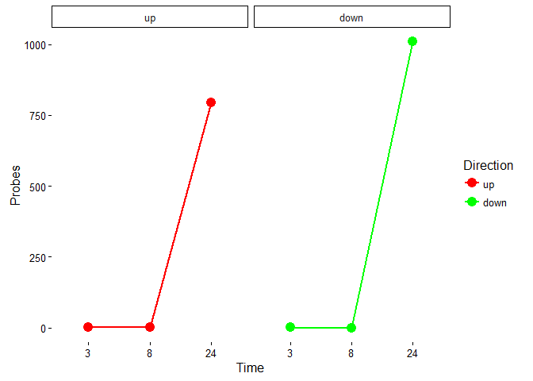

This is a subset of the vaginal explant microarray data. We subset for just the four donors that grouped together by hierarchical clustering in the heat map of V186.24 (323, 317,324,318)

I am subsetting for just TissueIDs 317 318 323 324 at all time points for V186

    ## Perform vst transformation ...
    ## 2016-10-14 12:37:15 , processing array  1 
    ## 2016-10-14 12:37:15 , processing array  2 
    ## 2016-10-14 12:37:15 , processing array  3 
    ## 2016-10-14 12:37:15 , processing array  4 
    ## 2016-10-14 12:37:15 , processing array  5 
    ## 2016-10-14 12:37:15 , processing array  6 
    ## 2016-10-14 12:37:15 , processing array  7 
    ## 2016-10-14 12:37:15 , processing array  8 
    ## 2016-10-14 12:37:15 , processing array  9 
    ## 2016-10-14 12:37:15 , processing array  10 
    ## 2016-10-14 12:37:15 , processing array  11 
    ## 2016-10-14 12:37:15 , processing array  12 
    ## 2016-10-14 12:37:15 , processing array  13 
    ## 2016-10-14 12:37:15 , processing array  14 
    ## 2016-10-14 12:37:15 , processing array  15 
    ## 2016-10-14 12:37:15 , processing array  16 
    ## 2016-10-14 12:37:15 , processing array  17 
    ## 2016-10-14 12:37:15 , processing array  18 
    ## 2016-10-14 12:37:15 , processing array  19 
    ## 2016-10-14 12:37:15 , processing array  20 
    ## 2016-10-14 12:37:16 , processing array  21 
    ## 2016-10-14 12:37:16 , processing array  22 
    ## 2016-10-14 12:37:16 , processing array  23 
    ## 2016-10-14 12:37:16 , processing array  24

    ## Perform rsn normalization ...
    ## 2016-10-14 12:37:17 , processing array  1 
    ## 2016-10-14 12:37:17 , processing array  2 
    ## 2016-10-14 12:37:17 , processing array  3 
    ## 2016-10-14 12:37:17 , processing array  4 
    ## 2016-10-14 12:37:17 , processing array  5 
    ## 2016-10-14 12:37:17 , processing array  6 
    ## 2016-10-14 12:37:17 , processing array  7 
    ## 2016-10-14 12:37:18 , processing array  8 
    ## 2016-10-14 12:37:18 , processing array  9 
    ## 2016-10-14 12:37:18 , processing array  10 
    ## 2016-10-14 12:37:18 , processing array  11 
    ## 2016-10-14 12:37:18 , processing array  12 
    ## 2016-10-14 12:37:18 , processing array  13 
    ## 2016-10-14 12:37:18 , processing array  14 
    ## 2016-10-14 12:37:18 , processing array  15 
    ## 2016-10-14 12:37:18 , processing array  16 
    ## 2016-10-14 12:37:18 , processing array  17 
    ## 2016-10-14 12:37:18 , processing array  18 
    ## 2016-10-14 12:37:18 , processing array  19 
    ## 2016-10-14 12:37:18 , processing array  20 
    ## 2016-10-14 12:37:18 , processing array  21 
    ## 2016-10-14 12:37:19 , processing array  22 
    ## 2016-10-14 12:37:19 , processing array  23 
    ## 2016-10-14 12:37:19 , processing array  24

    ## Perform Quality Control assessment of the LumiBatch object ...

Number of probes in data set before filtering:

    ## [1] 47323

Number of probes in data set after filtering:

    ## [1] 22513

Number of probes removed by filtering:

    ## [1] 24810

<table style="width:39%;">
<colgroup>
<col width="23%" />
<col width="9%" />
<col width="5%" />
</colgroup>
<thead>
<tr class="header">
<th align="center">variable</th>
<th align="center">down</th>
<th align="center">up</th>
</tr>
</thead>
<tbody>
<tr class="odd">
<td align="center">V186.3vsMock.3</td>
<td align="center">1</td>
<td align="center">2</td>
</tr>
<tr class="even">
<td align="center">V186.8vsMock.8</td>
<td align="center">0</td>
<td align="center">1</td>
</tr>
<tr class="odd">
<td align="center">V186.24vsMock.24</td>
<td align="center">1009</td>
<td align="center">794</td>
</tr>
</tbody>
</table>

Plot of \# of up and down regulated probes in the subset

V186 vs Mock at 3hr

V186 vs Mock at 8hr only has two probes so I can't make a heat map.

V186 vs mock at 24hr

Heatmap of logFC of virus vs mock for 186 24hrs

    ## $subset_V186.3
    ## NULL
    ## 
    ## $subset_V186.8
    ## NULL
    ## 
    ## $subset_V186.24
    ## NULL

    ## $subset_V186.3
    ## NULL
    ## 
    ## $subset_V186.8
    ## NULL
    ## 
    ## $subset_V186.24
    ## NULL

    ## $subset_V186.3
    ## NULL
    ## 
    ## $subset_V186.8
    ## NULL
    ## 
    ## $subset_V186.24
    ## NULL
